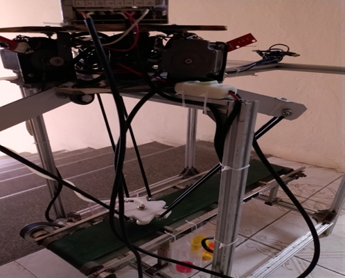
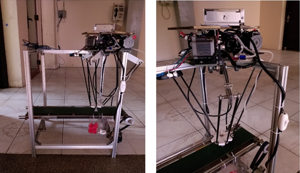
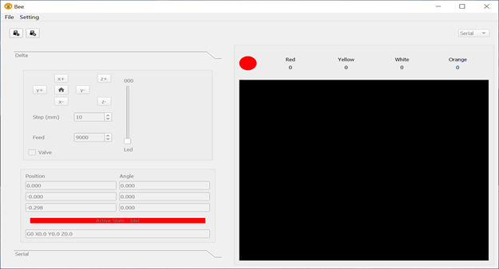

# BEE

## _My theses graduate_

Implement
.
.
Software
.

## Features
- Math, desgin in Nx, implement Delta Robot 3rus
- Using Step Motor size 57, Ramps 1.4, DVR8825
- Using atmega2560 and Marlin Firmware 
- Graphic control and monitor write on python 3.6
- Computer vision : detect the bottle cap
- Machine Learning : KNN to detect the bottle cap's color
